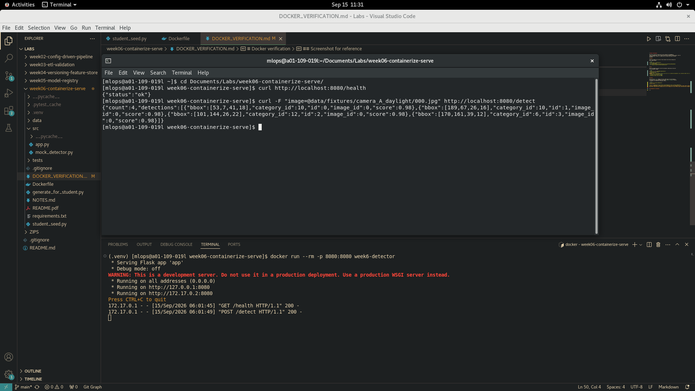

# Docker verification

Fill this in after you build and run your container (see README.md,
"Part 2 — Dockerfile"). This is how we confirm your container actually works, since an
automated grader running in a sandbox may not always have Docker-in-Docker
available.

## Build

Paste the command you ran and its final output line (the one showing the
built image ID/tag):

```bash
$ docker build -t week6-detector .
 => => writing image sha256:9093f58208a790a419d02ca58bcf96fecf7ff1f312b07795a11b9b22b8b19613                                                                                             0.0s
 => => naming to docker.io/library/week6-detector  
```

## Run

Paste the command you used to start the container (should map a host port
to the container's 8080):

```bash
$ docker run --rm -p 8080:8080 week6-detector
 * Serving Flask app 'app'
 * Debug mode: off
WARNING: This is a development server. Do not use it in a production deployment. Use a production WSGI server instead.
 * Running on all addresses (0.0.0.0)
 * Running on http://127.0.0.1:8080
 * Running on http://172.17.0.2:8080
```

## Verify

Paste the exact `curl` commands and their JSON output for both endpoints,
run against the running container (not against `python src/app.py` directly
— the point is to prove the *container* works):

```bash
$ curl http://localhost:8080/health
{"status":"ok"}

$ curl -F "image=@data/fixtures/camera_A_daylight/000.jpg" http://localhost:8080/detect
{"count":4,"detections":[{"bbox":[53,7,41,18],"category_id":10,"id":0,"image_id":0,"score":0.98},{"bbox":[189,67,26,16],"category_id":10,"id":1,"image_id":0,"score":0.98},{"bbox":[101,144,26,22],"category_id":12,"id":2,"image_id":0,"score":0.98},{"bbox":[170,161,39,12],"category_id":6,"id":3,"image_id":0,"score":0.98}]}
```

## Screenshot for reference

