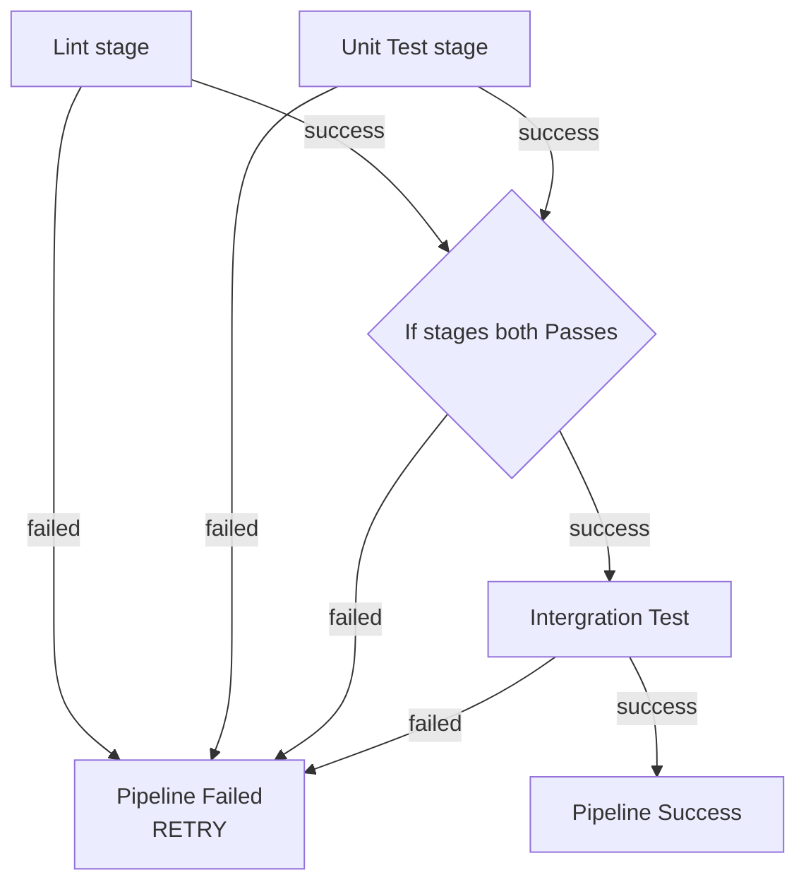

# NOTES.md — Week 7: CI/CD Integration Testing

**Student ID used with `generate_for_student.py`:**
<!-- paste the --student-id value you used -->
```
student_id: 112301042
seed: 113087254
```

## Why gate integration-test on needs: [lint, unit-test]?

<!-- Why does integration-test need needs: [lint, unit-test] instead of
     just running in parallel with them — what's the actual cost being
     avoided? -->
**ANSWER** :
- `integration-test` is more expensive because it builds and runs a Docker container (time and compute expensive).
- `lint` and `unit-test` are cheaper and can catch many problems in the earlier stages.
- Using `needs` prevents integration tests from running if the earlier one fails.
- This saves CI runner time and Docker resources. It also makes the CI pipeline more efficient.

