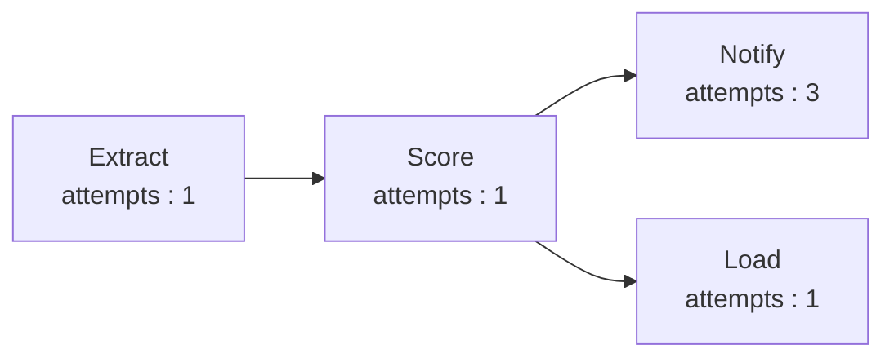

# NOTES.md — Week 9: Orchestrated Batch Scoring

**Student ID used with `generate_for_student.py`:**

student_id: 112301042
seed: 3035677167

## notify retry count

<!-- How many attempts did notify take in your run? (Check
     dag_run_summary.json.) -->
Notify took **3** attempts to run.
Refer [dag_run_summary.json](dag_run_summary.json) for more details.

## Branch independence

<!-- Why does load still succeed even though notify — its "sibling" in the
     DAG — failed on its first two attempts? What does that tell you about
     how failures in one branch of a DAG should (or shouldn't) affect an
     unrelated branch? -->
They are sibilings and are not depended on each other, they work independly
both have a common parent, and they only need depend on the parent to work, for them to work.

## Retry cost under FinOps

<!-- Tying back to this week's FinOps content: if notify were a metered API
     call you paid for per attempt, what would you change about the retry
     strategy, and why is "retry every failed task the same way" a risky
     default once cost enters the picture? -->

As its a paid API, retrying multiple times until we succeed can be costly,
one way is to reduce the number of retry attempts. More important way to overcome will be to see what the status code of on failed attempt, if it is some thing like server down. we should not halt it earlier than some some network latency issue.

As a server down will have more chances for the workflow to fail. so we could avoid the unnessary cost overhead.

