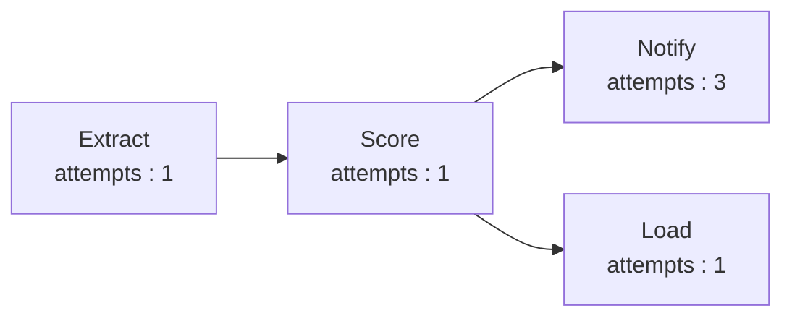

# NOTES.md — Week 9: Orchestrated Batch Scoring

**Student ID used with `generate_for_student.py`:**

student_id: 112301042
seed: 3035677167

## notify retry count

<!-- How many attempts did notify take in your run? (Check
     dag_run_summary.json.) -->
Notify took **3** attempts to run.
Refer [dag_run_summary.json](dag_run_summary.json) for more details.

## Branch independence

<!-- Why does load still succeed even though notify — its "sibling" in the
     DAG — failed on its first two attempts? What does that tell you about
     how failures in one branch of a DAG should (or shouldn't) affect an
     unrelated branch? -->
`notify` and `load` are sibling tasks because both depend only on `score`; neither task depends on the other. Therefore, the failure of `notify` on its first two attempts does not prevent `load` from running.

The DAG scheduler only requires a task's own dependencies to be completed successfully before running it. Since `score` completed successfully, both `notify` and `load` were eligible to run independently. A failure in one branch should therefore not affect an unrelated branch unless there is a dependency between them.

## Retry cost under FinOps

<!-- Tying back to this week's FinOps content: if notify were a metered API
     call you paid for per attempt, what would you change about the retry
     strategy, and why is "retry every failed task the same way" a risky
     default once cost enters the picture? -->

For a paid API, retrying every failure the same way can increase the cost unnecessarily. I would first look at the error status or type of failure. If it is a temporary network or server issue, we can retry, but for errors like an invalid request or authentication failure, retrying will not help and only adds cost. We could also keep a smaller retry limit or use increasing retry delays to reduce unnecessary API calls.

